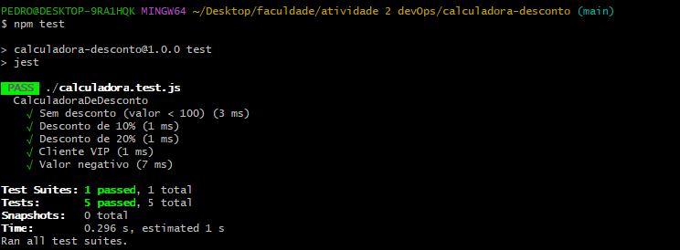
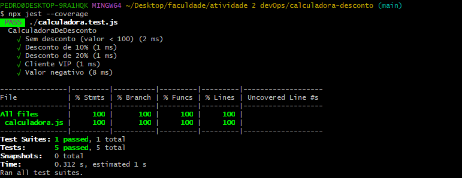

Calculadora de Desconto

Descrição:
Projeto com testes unitários utilizando Jest.

 Regras de negócio

 Valor < 100 → sem desconto
 100 a 500 → 10%
 500 → 20%
 VIP → +5%
 Valor negativo → erro

Testes:

Foram implementados 5 testes:
- Sem desconto
- 10% de desconto
- 20% de desconto
- Cliente VIP
- Valor negativo

Prints:

 Testes passando

 Cobertura 100%
